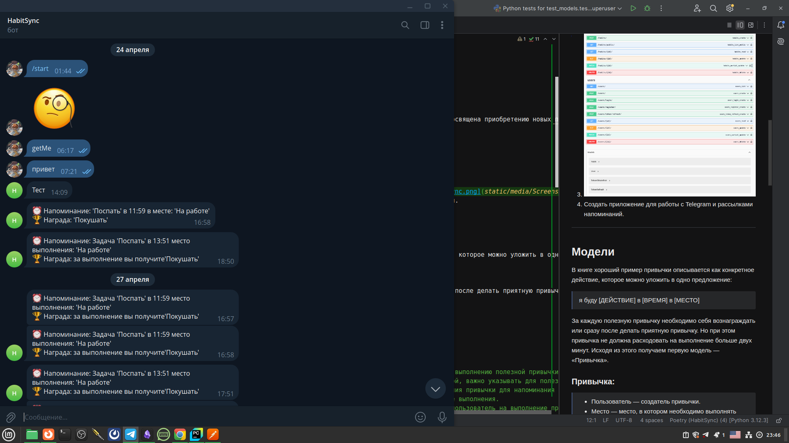
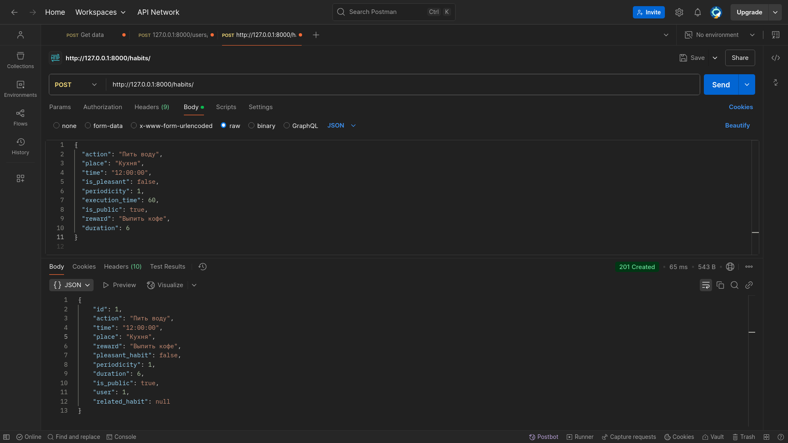

# HabitSync 
### Веб-приложение. Бэкенд-часть, синхронизированное сигналами на пользователя/исполнителя 
### напоминаниями в его телеграмм аккаунт, посредством телеграмм чат бота.


---

## Для запуска проекта


- Переименуйте файл .env.sample в .env и заполните его.
- Создайте базу данных в PostgreSQL
- 
- Добавьте пользователя

```shell
python manage.py csu    
```

## Контекст


В 2018 году Джеймс Клир написал книгу «Атомные привычки», которая посвящена приобретению новых полезных привычек и искоренению старых плохих привычек. Заказчик прочитал книгу, впечатлился и обратился к вам с запросом реализовать трекер полезных привычек.

---

## Описание задач

1. Добавить необходимые модели привычек.
2. Реализовать эндпоинты для работы с фронтендом.
3. 
3. Создать приложение для работы с Telegram и рассылками напоминаний.

---

## Модели

В книге хороший пример привычки описывается как конкретное действие, которое можно уложить в одно предложение:

> я буду [ДЕЙСТВИЕ] в [ВРЕМЯ] в [МЕСТО]

За каждую полезную привычку необходимо себя вознаграждать или сразу после делать приятную привычку. Но при этом привычка не должна расходовать на выполнение больше двух минут. Исходя из этого получаем первую модель — «Привычка».

 ### Привычка:
> 
> 
> - Пользователь — создатель привычки.
> - Место — место, в котором необходимо выполнять привычку.
> - Время — время, когда необходимо выполнять привычку.
> - Действие — действие, которое представляет собой привычка.
> - Признак приятной привычки — привычка, которую можно привязать к выполнению полезной привычки.
> - Связанная привычка — привычка, которая связана с другой привычкой, важно указывать для полезных привычек, но не для приятных.
> - Периодичность (по умолчанию ежедневная) — периодичность выполнения привычки для напоминания в днях.
> - Вознаграждение — чем пользователь должен себя вознаградить после выполнения.
> - Время на выполнение — время, которое предположительно потратит пользователь на выполнение привычки.
> - Признак публичности — привычки можно публиковать в общий доступ, чтобы другие пользователи могли брать в пример чужие привычки.

### Чем отличается полезная привычка от приятной и связанной?


**Полезная привычка** — это само действие, которое пользователь будет совершать и получать за его выполнение определенное вознаграждение (приятная привычка или любое другое вознаграждение).

**Приятная привычка** — это способ вознаградить себя за выполнение полезной привычки. Приятная привычка указывается в качестве связанной для полезной привычки (в поле «Связанная привычка»).

_Например_: в качестве полезной привычки вы будете выходить на прогулку вокруг квартала сразу же после ужина. Вашим вознаграждением за это будет приятная привычка — принять ванну с пеной. То есть такая полезная привычка будет иметь связанную привычку.

_Рассмотрим другой пример_: полезная привычка — «я буду не опаздывать на еженедельную встречу с друзьями в ресторан». В качестве вознаграждения вы заказываете себе десерт. В таком случае полезная привычка имеет вознаграждение, но не приятную привычку.

**Признак приятной привычки** — булево поле, которые указывает на то, что привычка является приятной, а не полезной.

---

## Валидаторы


- Исключить одновременный выбор связанной привычки и указания вознаграждения.

> _В модели не может быть заполнено одновременно и поле вознаграждения, и поле связанной привычки. Можно заполнить только одно из двух полей._

- Время выполнения должно быть не больше 120 секунд.
- В связанные привычки могут попадать только привычки с признаком приятной привычки.
- У приятной привычки не может быть вознаграждения или связанной привычки.
- Нельзя выполнять привычку реже, чем 1 раз в 7 дней.

> _Нельзя не выполнять привычку более 7 дней. Например, привычка может повторяться раз в неделю, но не раз в 2 недели. За одну неделю необходимо выполнить привычку хотя бы один раз._

---

## Пагинация


Для вывода списка привычек реализована пагинация с выводом по 5 привычек на страницу.

---

## Права доступа

- Каждый пользователь имеет доступ только к своим привычкам по механизму CRUD.
- Пользователь может видеть список публичных привычек без возможности их как-то редактировать или удалять.

---

## Эндпоинты


- Регистрация.
- Авторизация.
- Список привычек текущего пользователя с пагинацией.
- Список публичных привычек.
- Создание привычки.
- Редактирование привычки.
- Удаление привычки.

---

## Интеграция


Для полноценной работы сервиса реализована работа с отложенными задачами для напоминания о том, в какое время какие привычки необходимо выполнять.

Для этого интегрирован сервис с мессенджером Телеграм, который занимается рассылкой уведомлений.

---

## Безопасность

Для проекта настроен CORS, чтобы фронтенд мог подключаться к проекту на развернутом сервере.

---

## Документация

Для реализации экранов силами фронтенд-разработчиков настроен вывод документации.

[Через SWAGGER жмякни тут](http://127.0.0.1:8000/swagger/)
<br>
[Через REDOC жмякай сюда](http://127.0.0.1:8000/redoc/)
